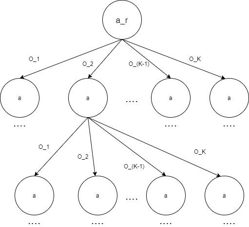

# MDL Assignment 3, Part  2

* Ayush Sharma (2019101004)
* Nitin Chandak (2019101024)


<hr>

First Roll Number = 2019101004  

Second Roll Number = 2019101024  

Used Roll Number = 2019101004

LastFourDigitsOfRollNumber = 1004

x = 1 - (((LastFourDigitsOfRollNumber)%30 + 1) / 100) = 1 - 0.15 = 0.85

Success Reward = (RollNumber%90 + 10) = (2019101004%90 + 10) = 64

**Few asusmptions:**

* States are : [(A<sub>i</sub>, A<sub>j</sub>), (T<sub>i</sub>, T<sub>j</sub>), call] & sorted in ascending order.
* Whenever not specified we assume probabilities to be uniform.
* Discount factor is assumed to be 10.

# Given Data


**Positions :**

* Possible Positions of an Agent or Target :

    | Pos_Grid         | col = 0 | col = 1 | col = 2 | col = 3 |
    | -                | -       | -       | -       | -       |
    |  <b>row = 0</b>  | (0, 0)  | (0, 1)  | (0, 2)  |  (0, 3) |
    |  <b>row = 1</b>  | (1, 0)  | (1, 1)  | (1, 2)  |  (1, 3) |

**Target's Actions :**

* Movement Probability Distribution of a Target is following:
    | Action      | STAY   | UP     | DOWN   | LEFT   | RIGHT  |
    | -           | -      | -      | -      | -      | -      |
    | Probability | 0.6    | 0.1    | 0.1    | 0.1    | 0.1    |
* If Target try to move out of the grid world, it will remain at the same pos. with  0.1 probability.
* The calling functionality of Target is independent of its movement.

    | Action      | Call On   | Call Off     |
    | -           | -         | -            |
    | Probability | 0.5       | 0.1          |


**Transition probabilities for the agent :**

* Since, x = 0.85 in our case. Hence, the following table:

    | Action              | STAY   | UP     | DOWN   | LEFT   | RIGHT  |
    | -                   | -      | -      | -      | -      | -      |
    | Success Probability | 1      | 0.85   | 0.85   | 0.85   | 0.85   |
    | Failure Probability | 0      | 0.15   | 0.15   | 0.15   | 0.15   |

* For, failure of `Non-STAY` action, the agent moves in the opposite direction.
* For either of success or failure, if Agent try to move outside the grid world it will stay at the same position with given success or failure prob. resp.


**Possible Observations from the Grid World :**

* All observation have 100% accuracy.

    | Observation |Target's Position w.r.t Agent's position |
    | -           | -                                       |
    | o1          | Same                                    |
    | o2          | Right                                   |
    | o3          | Below                                   |
    | o4          | Left                                    |
    | o5          | Above                                   |
    | o6          | Not in the 1 cell neighbourhood         |

**Rewards :**

* -1 for each step that Agent takes.
* (RollNumber%90 + 10) = 64 for reaching the target before the call is turned off.


# Question 1

**Target Cell :** (1, 0)

**Observation :** O6 with 100% accuracy

Therefore, initial equi-probable possible positions of the Agent: `(0,1)`, `(0,2)`, `(0,3)`, `(1,2)` and `(1,3)`.
Also, for each cell the agent is likely to be in, the target is equally likely to be or not to be on a call.

Thus,start states are following:-

S = { `(0,1,1,0,0)`,`(0,2,1,0,0)`,`(0,3,1,0,0)`,`(1,2,1,0,0)`,`(1,3,1,0,0)`,`(0,1,1,0,1)`,`(0,2,1,0,1)`,`(0,3,1,0,1)`,`(1,2,1,0,1)`, `(1,3,1,0,1)` } and all of them are equally likely.

Clearly, `|s| = 10`.

Therefore, belief state `b` i.e. probability distribution over our set of states will be:
```
b(s) = 0.1 ∀ s ∈ S 
otherwise b(s) = 0.
```


**Initial Belief State**: 

[0, 0, 0, 0, 0, 0, 0, 0, 0, 0, 0, 0, 0, 0, 0, 0, 0, 0, 0, 0, 0, 0, 0, 0, 0.1, 0.1, 0, 0, 0, 0, 0, 0, 0, 0, 0, 0, 0, 0, 0, 0, 0.1, 0.1, 0, 0, 0, 0, 0, 0, 0, 0, 0, 0, 0, 0, 0, 0, 0.1, 0.1, 0, 0, 0, 0, 0, 0, 0, 0, 0, 0, 0, 0, 0, 0, 0, 0, 0, 0, 0, 0, 0, 0, 0, 0, 0, 0, 0, 0, 0, 0, 0, 0, 0, 0, 0, 0, 0, 0, 0, 0, 0, 0, 0, 0, 0, 0, 0.1, 0.1, 0, 0, 0, 0, 0, 0, 0, 0, 0, 0, 0, 0, 0, 0, 0.1, 0.1, 0, 0, 0, 0, 0, 0]


**NOTE :** The optimal policy file for the POMDP taking into account the obtained initial belief state `b` is `2019101004_2019101024.policy`.

# Question 2

**Agent Cell :** (1, 1)

As target is in one cell neighbourhood of agent & not making call. Hence, possible equi-probable  positions of the target are : `(0,1)`, `(1,0)`, `(1,1)` and `(1,2)`. 

And target is not making call. Thus,start states are following:-

S = { `(1,1,0,1,0)`,`(1,1,1,0,0)`,`(1,1,1,1,0)`,`(1,1,1,2,0)` } and all of them are equally likely.

Clearly, `|s| = 4`.


Therefore, belief state `b` i.e. probability distribution over our set of states will be:
```
b(s) = 0.25 ∀ s ∈ S 
otherwise b(s) = 0.
```

**Initial Belief State**: 

[0, 0, 0, 0, 0, 0, 0, 0, 0, 0, 0, 0, 0, 0, 0, 0, 0, 0, 0, 0, 0, 0, 0, 0, 0, 0, 0, 0, 0, 0, 0, 0, 0, 0, 0, 0, 0, 0, 0, 0, 0, 0, 0, 0, 0, 0, 0, 0, 0, 0, 0, 0, 0, 0, 0, 0, 0, 0, 0, 0, 0, 0, 0, 0, 0, 0, 0, 0, 0, 0, 0, 0, 0, 0, 0, 0, 0, 0, 0, 0, 0, 0, 0.25, 0, 0, 0, 0, 0, 0.25, 0, 0.25, 0, 0.25, 0, 0, 0, 0, 0, 0, 0, 0, 0, 0, 0, 0, 0, 0, 0, 0, 0, 0, 0, 0, 0, 0, 0, 0, 0, 0, 0, 0, 0, 0, 0, 0, 0, 0, 0]

# Question 3


# Question 4

* Agent's Possible position & probability

    | State       | (0,0)  | (1,3)  |
    | -           | -      | -      |
    | Probability | 0.4    | 0.6    |
    
    

* Targets's Possible position & probability. (Call of Target doesn't matter as no observation detects it.)

    | State       | (0,1)  | (0,2)  | (1,1)  | (1,2)  |
    | -           | -      | -      | -      | -      |
    | Probability | 0.25   | 0.25   | 0.25   | 0.25   |
    
    

| Positions (Agent, Target) | Possible Observation | Probability |
| -                         | -                    | -           |
| [(0,0),(0,1)]             | o2                   | 0.1         |
| [(0,0),(0,2)]             | o6                   | 0.1         |
| [(0,0),(1,1)]             | o6                   | 0.1         |
| [(0,0),(1,2)]             | o6                   | 0.1         |
| [(1,3),(0,1)]             | o6                   | 0.15        |
| [(1,3),(0,2)]             | o6                   | 0.15        |
| [(1,3),(1,1)]             | o6                   | 0.15        |
| [(1,3),(1,2)]             | o4                   | 0.15        |


Now we have,

Probability(observation) = ∑<sup>n</sup><sub>i=0</sub> { Probability (observation | state) × Probability (state) }

So calculating this probability for every observation,

P(o1) = Σ (P(o1|state)*P(state)) = 0

P(o2) = Σ (P(o2|state)*P(state)) = (P(o2|Agent in (0,0) and Target in (0,1) )*P(Agent in (0,0) and Target in (0,1) )) = 1 * 0.1 = 0.1

P(o3) = Σ (P(o3|state)*P(state)) = 0

P(o4) = Σ (P(o4|state)*P(state))
= { P (o4 | (Agent in (1,3) and Target in (1,2)) ) * P (Agent in (1,3) and Target in
(1,2))} = 1 * 0.15 = 0.15

P(o5) = Σ (P(o5|state)*P(state)) = 0

P(o6) = Σ (P(o6|state)*P(state))

= (P(o6|Agent in (0,0) and Target in (0,2)) * P(Agent in (0,0) and Target in (0,2))) + 

(P(o6|Agent in (0,0) and Target in (1,1)) * P(Agent in (0,0) and Target in (1,1))) +

(P(o6|Agent in (0,0) and Target in (1,2) ) * P(Agent in (0,0) and Target in (1,2) )) +

(P(o6|Agent in and (1,3) Target in (0,1)) * P(Agent in (1,3) and Target in (0,1))) +

(P(o6|Agent in and (1,3) Target in (0,2)) * P(Agent in (1,3) and Target in (0,2))) +

(P(o6|Agent in (1,3) and Target in (1,1)) * P(Agent in (1,3) and Target in (1,1)))

=1 * 0.1 + 1 * 0.1 + 1 * 0.1 + 1 * 0.15 + 1 * 0.15 + 1 * 0.15 = 0.1 + 0.1 + 0.1 + 0.15 + 0.15 + 0.15 = 0.75


**Hence, <b>O6</b> is clearly the most like observation, as it has the highest probability.**


# Question 5


The number of policy tree obtained is equal to |A|<sup>N</sup>;  where

N = ∑<sub>i</sub> |o|<sup>i</sup>  
for all i ∈ { 0, 1, 2, ... , T-1 }

=> N = [ |O|<sub>T</sub> −1 ] / [ |O| −1 ]

Where 

|A| denotes the number of actions,

|O| denotes the number of observations,

And T denotes the time horizon.


For our given case:-

|A| = 5 and |O| = 6 and T is the time horizon - unknown variable.

Thus, N = [ 6<sup>T</sup> −1 ] / [ 6 −1 ] = [ 6<sup>T</sup> −1 ] / [ 5 ]

Therefore, total number of policy trees are = |A|<sup>N</sup> = 5<sup>N</sup>




As we can clearly see from the above image that as the time horizon is
increased, the convergence of the nodes is not easy and so if the time horizon increases, there would be more and more policy trees and that would be a very large exponential value, and therefore it shows that why we get such large number of policy trees.